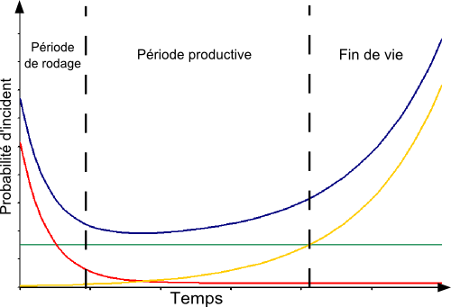

Lors d'un de mes précédents job, j'ai eu l'occasion de travailler avec la loi de Weibull pour calculer *"correctement"* **le temps moyen entre deux pannes** (MTBF) d'un équipement. Et comme c'est pas un sujet si facile, voila quelques explication sur cette loi.

> N'étant moi même pas expert sur ce sujet, il est possible que je fasse des erreurs d'explications. Comme tout ce qui est sur internet : à prendre avec des pincettes :smile: !

## Le temps moyen entre deux pannes

Pour comprendre pourquoi nous avons besoin d'outils comme la loi de Weibull, prenons un example tout simple : 

> Sur 500000 personnes de 25 ans pendant une année d'observation, on note 625 décés. Si on considère une personne comme une machine, et la mort comme une panne, comment pouvons nous calculer le temps moyen pour arriver à une panne ?

Et bien si on prend la définition suivante :

> Si la loi de fiabilité du système est une loi exponentielle (cas typique des composants électroniques), c'est-à-dire si le taux de défaillance λ est constant, alors le MTTF (Mean Time To Failure = temps moyen de fonctionnement avant panne) est l’inverse de λ :

$$
MTTF = \frac{1}{\lambda}
$$

Et comme le taux de défaillance c'est simplement $\lambda=\frac{nbr\space de\space defaillances}{temps\space d'observation\space cumulee}$, on calcul facilement : 

$$
\lambda=\frac{625}{1*500000}=0,00125\space (defaillances/an)
$$

Et enfin,

$$
MTTF=\frac{1}{0,00125}=800\space ans
$$

Donc on vient de voir que mathématiquement un homme de 25 ans à une espérance de vie de 800 ans ! Sympa non ?

Effectivement l'erreur vient de l'hypothèse $\lambda(t)=cte$. C'est peut être vrai pour des composants électroniques, mais pour des être humains ça ne marche visiblement pas. Un homme de 25 ans a beaucoup plus de chance d'être en pleine forme, alors qu'en vieillissant la fréquence des problèmes s'intensifie. Ce qui ramène l'espérance de vie vers 85 ans.

Et en entreprise beaucoups de mes collègues utilisaient ce même résonnement pour des équipements mécanique qui n'ont pas *à priori* un taux de défaillance constant.

En réalité, il y a toujours une __phase de rodage__ et une __phase de vieillesse__ qui s'applique à chaque produit, comme le montre la courbe du taux de défaillance *"en baignoire"* ci-dessous : 

Image par <a href="//commons.wikimedia.org/wiki/User:Unique_Nitrogen" title="User:Unique Nitrogen">Unique Nitrogen</a> — Travail personnel, <a href="https://creativecommons.org/licenses/by-sa/3.0" title="Creative Commons Attribution-Share Alike 3.0">CC BY-SA 3.0</a>, <a href="https://commons.wikimedia.org/w/index.php?curid=28910007">Lien</a>
 

La courbe du taux de défaillance (bleue) est le résultats de la somme de la courbe de la *période de rodage* (rouge), avec celle de la *préiode productive* (verte) etcelle de *fin de vie* (jaune).

La loi de Weibull elle s'adapte très bien pour ce genre de calculs car elle recouvre toute une famille de lois de probabilités, et permet ainsi calculer plus correctement la fiabilité des équipements.

Il faut donc toujours se demander si les hypothèses sont bonnes avant de se lancer dans un calculs.

## Et la loi de Weibull alors ?

Avant de rentrer dans le vif du sujet, voici quelques questions auxquelles nous pouvons répondre avec la loi de Weibull : 

- :confused: Combien d'éléments risque de connaitre une défaillance pendant la phase de rodage ?
- :worried: Quand l'usure de fin de vie devrait-elle se produire ?
- :frowning: Quand devons nous planifier la maintenance ?
- :weary: Combien de demande de garantie allons-nous recevoir en moyenne ?

### Densité de probabilité

La densité de probabilité de la loi de Weibull est donnée par la formule suivante : 

$$
f(x;k,\lambda)=\frac{k}{\lambda}(\frac{x}{\lambda})^{k-1}e^{-(x/\lambda)^{k}}
$$

Avec $k > 0$ le paramètre de forme, et $\lambda > 0$ le paramètre d'échelle de la distribution.

> La [dentisté de probabilité](https://fr.wikipedia.org/wiki/Variable_al%C3%A9atoire_%C3%A0_densit%C3%A9) c'est la fonction que l'on doit intégrer pour obtenir la probabilité d'un évènement sur un intervalle donné. $\mathbb{P}(a<X<b)=\int_a^{b}f(x)dx $

Pour mieux comprendre l'impacte que peut avoir ces paramètres, j'ai créer un petit graphique intéractif où vous pouvez modifier les différents paramètres de la fonction de distribution :

### Graphique intéractif

<interactive-weibull-graph></interactive-weibull-graph>

