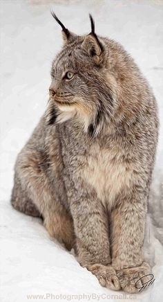

J'aime bien les lynx, voici la page officiel de *Wikipedia* sur les 
[Lynx](http://fr.wikipedia.org/wiki/lynx).

> Les lynx (genre Lynx) sont des félins de la sous-famille des félinés. Parmi les félins, les lynx sont aisément reconnaissables à leur face ornée de favoris, à leurs oreilles triangulaires surmontées d'une touffe de poils noirs, et à leur corps doté d'une courte queue et de longues pattes. Parmi les caractéristiques moins visibles, les lynx ne possèdent que 28 dents, au lieu des 30 dents habituelles chez les félins.

